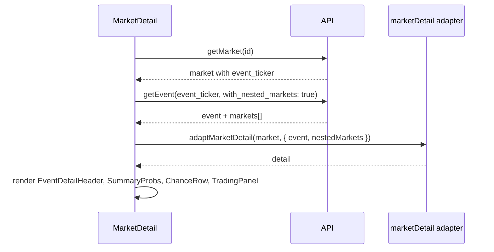

# 2.3 市场详情页技术方案（实现说明）

- **版本**：v1
- **日期**：2025-02-05
- **适用功能**：2.3 市场详情页（见 [01_requirements.md](01_requirements.md) 第 2.3 节）
- **说明**：本文档描述市场详情页从 mock 改为真实 API 的逻辑与实现步骤；与 [02_interface.md](02_interface.md)、项目根目录 [04-API.md](../../04-API.md) 对齐。实现后需按 [logs.cursorrules](../../skills/logs.cursorrules) 执行 log_change.py。

---

## 一、需求与现状

### 1.1 01_requirements 2.3 要求

- **事件头**：分类、子类、标题、头图。
- **概率与图表**：概率汇总、历史概率图表、成交量。
- **Chance 列表**：各选项 Yes/No 价格、选中态、「More markets」链接。
- **交易面板**：Buy/Sell 切换、金额输入、Yes/No 按钮（本期仅 UI）。
- **免责声明与 AI 分析**：若有数据则展示。

### 1.2 当前实现

- 路由：`/markets/:id`，`id` 为 **market ticker**（与列表页卡片 `card.id` 一致，见 `src/pages/MarketDetail.jsx`）。
- 数据：来自 `src/lib/mockMarketDetail.js` 的 `getMarketDetail(id)`，无真实 API。
- 组件：EventDetailHeader、SummaryProbs、ProbabilityChart、ChanceRow、TradingPanel 已存在，入参为适配后的 `detail` 与 `candidates`。
- 适配器：`src/lib/adapters/marketDetail.js` 的 `adaptMarketDetail(market, { event, nestedMarkets })` 已支持「单 market 二元 Yes/No」与「event + 多 market 多选项」两种形态，输出 `title/category/subcategory/eventImage/volume/disclaimer/aiAnalysis/summaryCandidates/chartData/candidates`。

---

## 二、数据流与接口

- **入参**：URL 中的 `id` = market ticker（例如从列表点入的 `KXBTCRESERVE-27-JAN01`）。
- **步骤**：
  1. `GET /api/v1/markets/{ticker}` → 当前市场详情，得到 `event_ticker`。
  2. `GET /api/v1/events/{event_ticker}?with_nested_markets=true` → 事件信息 + 同事件下所有 markets（用于事件头、Chance 多选项、AI 文本）。
- **适配**：`adaptMarketDetail(market, { event, nestedMarkets: event.markets })`，输出与现有页面组件一致的 `detail` 结构。

---

## 三、接口与字段映射（02_interface 为准）

- **GET /api/v1/markets/{ticker}**：04-API 约定 `data` 为单 market 对象，字段与 02_interface 4.4 一致（ticker, event_ticker, title, yes_sub_title, no_sub_title, yes_bid, yes_ask, no_bid, no_ask, *_dollars, last_price, volume_fp, volume_24h_fp, rules_primary, rules_secondary 等）。
- **GET /api/v1/events/{event_ticker}**：04-API 约定 `data` 为单 event；请求时带 `with_nested_markets=true` 时含 `markets[]`。Event 字段同 02_interface 4.3（title, sub_title, category, anchors, blindspots 等）。

| 详情页区块 | 数据来源 | 字段 / 计算 |
|------------|----------|-------------|
| 事件头 title | event.title \|\| market.title | 02 event.title / market.title |
| 事件头 category / subcategory | event.category / event.sub_title | 02 Event 对象 |
| 事件头 eventImage | event.image_url 等（当前接口若无则 null） | 占位保留 |
| 概率汇总 summaryCandidates | 每个 market 或 Yes/No 两行 | 单 market：yes_sub_title/no_sub_title + 概率；多 market：每 market 一行，概率见下 |
| 概率 human（汇总与 Chance 行） | Market | **(yes_ask + yes_bid) / 2**（与 2.2 一致），缺则 last_price |
| Chance 行 Yes/No 价格 | Market | yesCents = yes_bid（已为分）；noCents = no_bid；缺则用 _dollars 转分 |
| 成交量 volume | market.volume_fp \|\| volume_24h_fp | formatVolume |
| 历史图表 chartData | 无接口 | 保持 null，UI 仅展示 volume 或占位 |
| 免责声明 disclaimer | event 或 market | rules_primary \|\| product_metadata.important_info 等，无则 null |
| AI 分析 aiAnalysis | Event | **anchors + blindspots** 拼接（与 2.2 一致） |
| More markets 链接 | — | `/category/all` 或同系列（若有 series_ticker 可链到 `/category/xxx`） |

---

## 四、实现步骤

### 4.1 接口调用（MarketDetail 页）

- **文件**：`src/pages/MarketDetail.jsx`
- **逻辑**：
  - 使用 `useParams().id` 作为 market ticker；`useEffect` 内先 `getMarket(id)`，失败或无效则 `setDetail(null)` 并可选 `<Navigate to="/" />`。
  - 若 `res.data.event_ticker` 存在，再请求 `getEvent(res.data.event_ticker, { with_nested_markets: true })`。
  - 两请求均成功后调用 `adaptMarketDetail(market, { event: eventRes.data, nestedMarkets: eventRes.data?.markets ?? [] })`，将结果设为 `detail` 状态。
  - 保留 loading / error 状态（如 `detailLoading`、`detailError`），加载中显示占位或 “Loading…”，错误可提示并保留返回首页或重试。
- **兼容**：若后端未返回 event（或 getEvent 失败），可仅用 market 调用 `adaptMarketDetail(market)`（无 event、无 nestedMarkets），适配器已支持单 market 二元形态。

### 4.2 适配器与 2.2/2.3 对齐

- **文件**：`src/lib/adapters/marketDetail.js`
- **修改**：
  - **aiAnalysis**：优先使用 **event.anchors 与 event.blindspots 拼接**（与 2.2 一致）；无 event 时再回退 `primary.ai_analysis ?? event?.ai_analysis`。
  - **disclaimer**：可从 event 或 market 取 `rules_primary`、或 event.product_metadata.important_info 的 markdown/文案；无则 null。
  - **Human 概率（summaryCandidates 与 candidates.pct）**：与列表页一致，使用 **(yes_ask + yes_bid) / 2**（两者均有效时），否则 `last_price`；对应 02_interface 的 0–100 整型。
  - **yesCents / noCents**：API 若返回 `yes_bid` / `no_bid`（0–100 分），直接使用；否则用 `dollarsToCents(yes_bid_dollars)` 等，保证 ChanceRow、TradingPanel 展示正确。

### 4.3 移除 mock、保留兜底

- **文件**：`src/pages/MarketDetail.jsx`
- 删除对 `getMarketDetail(id)`（mock）的引用，改为上述 API + 适配器流程。
- 若需在开发时保留 mock 兜底，可保留 `src/lib/mockMarketDetail.js` 并在 API 失败时回退（可选）；否则可不再使用。

### 4.4 其他

- **More markets**：链接保持 `<Link to="/category/all">` 或根据 `event.series_ticker` / category 链到对应分类页（与 01_requirements 一致）。
- **交易面板**：本期仅 UI，不接下单接口；TradingPanel 与 ChanceRow 仅消费适配后的 `candidates`（含 yesCents、noCents、name、pct 等）。
- **ProbabilityChart**：`chartData` 仍为 null 时，组件内部可仅展示 volume 或占位，无需新增接口。

### 4.5 规范与飞行记录（logs.cursorrules）

- 实现完成后，按 `docs/skills/logs.cursorrules` 执行一次 **log_change.py**：
  - `change_type`: Feature
  - `summary`: 市场详情页 2.3 接真实 API（getMarket + getEvent），适配器对齐事件头、Chance 列表、human 概率 (yes_ask+yes_bid)/2、AI 文本 anchors+blindspots、免责声明与 Yes/No 价格
  - `risk_analysis`: 列出可能回归点（例如无 event_ticker 时仅单 market 展示、getEvent 失败时的降级、空 markets 数组时的展示）

---

## 五、产出与不修改范围

- **产出**：MarketDetail.jsx 改为 getMarket + getEvent 双请求与状态管理；marketDetail.js 适配器补充 aiAnalysis（anchors+blindspots）、disclaimer、human 概率 (yes_ask+yes_bid)/2、yesCents/noCents 来源；执行 log_change.py 写入 docs/AI_CHANGELOG.md。
- **不修改**：路由定义、EventDetailHeader / SummaryProbs / ProbabilityChart / ChanceRow / TradingPanel 的 props 契约（仅保证适配器输出满足现有契约）；02_interface.md 增补详情接口，以 04-API 与 02 的 Event/Market 对象为准。
