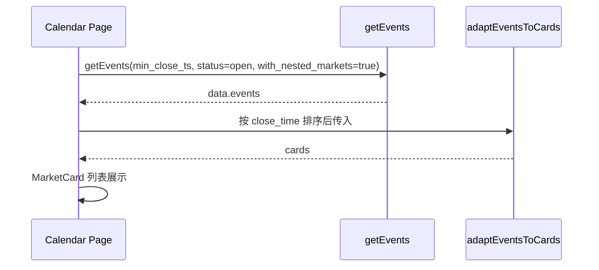

# 2.4 Live（日历）实现说明

- **版本**：v1
- **日期**：2025-02-05
- **适用功能**：2.4 Live（日历）（见 [01_requirements.md](01_requirements.md) 第 2.4 节）
- **说明**：本文档描述 Live（日历）页面的接口约定、数据流与实现要点；与 [02_interface.md](02_interface.md)、项目根目录 [04-API.md](../../04-API.md) 对齐。

---

## 一、需求摘要

- **页面**：`/calendar`（Header「Live」指向该路径）。
- **内容**：展示即将到期或进行中的市场/事件，与 API 的 **min_close_ts**、**status** 对应。
- **实现**：直接对接 API，使用 `GET /api/v1/events`，参数 `min_close_ts`、`status=open`、`with_nested_markets=true`。

---

## 二、接口约定

- **接口**：`GET /api/v1/events`（[src/lib/api.js](../../src/lib/api.js) 的 `getEvents`）。
- **参数**：

| 参数 | 类型 | 说明 |
|------|------|------|
| min_close_ts | int | 当前时间 Unix 秒，仅返回关闭时间在此之后的事件 |
| status | string | `open`，仅进行中 |
| with_nested_markets | boolean | `true`，便于展示事件下市场及 close_time |
| limit | int | 如 80 |

- **响应**：`data.events[]`，结构见 [02_interface.md](02_interface.md) 第四节（Event 对象含 markets[]，market 含 close_time、ticker、title 等）。

---

## 三、数据流与排序

1. 页面挂载时调用 `getEvents({ min_close_ts, status: 'open', with_nested_markets: true, limit })`。
2. 对返回的 `data.events` 过滤：仅保留 `event.markets` 非空且至少有一个 market 的 event。
3. 排序：按每个 event 的 `markets[0].close_time`（ISO 字符串）升序，最近即将到期在前。
4. 使用 `adaptEventsToCards(events)` 得到卡片数组，与 2.2 一致。
5. 使用 MarketCard 渲染列表，卡片链接至 `/markets/{firstMarket.ticker}`。

---

## 四、实现要点

- **路由**：App.jsx 中 `<Route path="/calendar" element={<Calendar />} />`。
- **页面**：`src/pages/Calendar.jsx`，状态 `cards`、`loading`、`error`；请求在 `useEffect` 内执行，排序与过滤后调用 `adaptEventsToCards`。
- **列表**：复用 `adaptEventsToCards` 与 MarketCard，与首页一致的卡片网格布局。
- **错误与空态**：请求失败展示 error 文案；无数据展示「暂无即将到期的事件」。
- **Header**：Live 使用 `<Link to="/calendar">`，当 `location.pathname === '/calendar'` 时为 Live 添加 `nav-link--active`，实现 SPA 内路由与高亮。

---

## 五、产出与不修改范围

- **产出**：App.jsx 新增 /calendar 路由；新建 Calendar.jsx、Calendar.css；技术文档本文件（04_calendar_implementation.md）；Header 改为 Link 并支持 Live 高亮。
- **不修改**：getEvents API 签名、adaptEventsToCards/adaptEventToCard、MarketCard 组件；02_interface 已含 min_close_ts，无需改。
